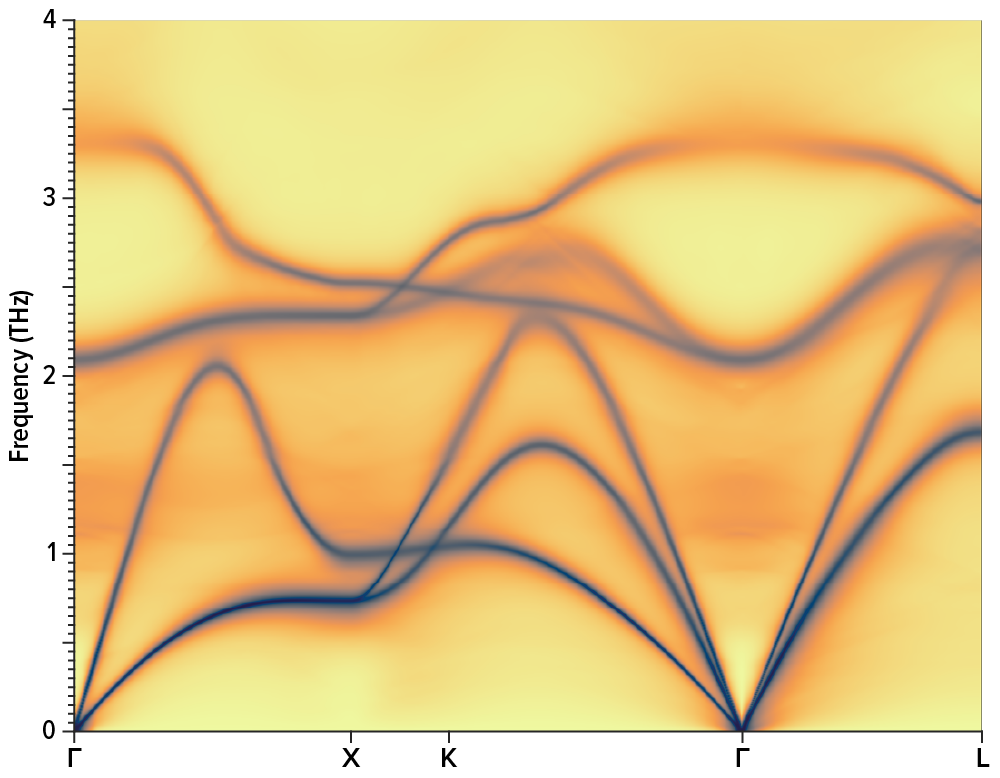
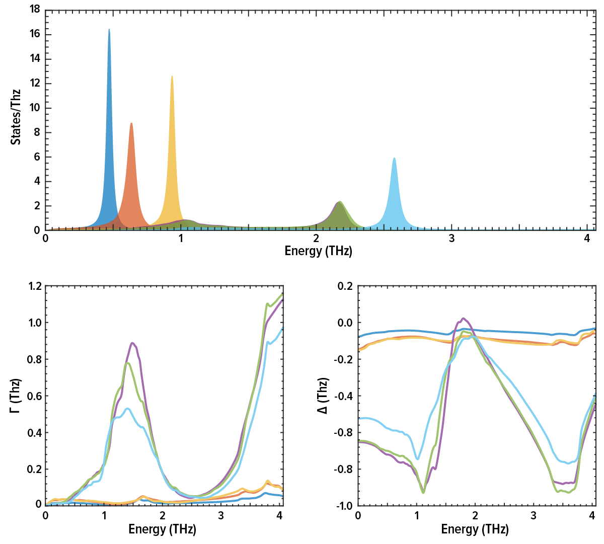

### Short description

Calculate the frequency-dependent self-energy and phonon spectral function.

### Command line options:


Optional switches:

* `--unit value`, value in: `thz,mev,icm`  
    default value thz  
    Choose the output unit. The options are terahertz (in frequency, not angular frequency), inverse cm or meV.

* `--temperature value`  
    default value 300  
    Temperature used in the occupation numbers. Should be the same as the temperature the force constants where determined at.

* `--n_energies value`, `-ne value`  
    default value 1200  
    Number of energies for the energy-dependent self-energy.

* `--qpoint_grid value#1 value#2 value#3`, `-qg value#1 value#2 value#3`  
    default value 26 26 26  
    Density of q-point mesh for Brillouin zone integrations.

* `--meshtype value`, value in: `1,2,3`  
    default value 2  
    Type of q-point mesh. 1 Is a Monkhorst-Pack mesh, 2 an FFT mesh and 3 my fancy wedge-based mesh with approximately the same density the grid-based meshes. 4 build the commensurate mesh of an approximately cubic supercell.

* `--integrationtype value`, `-it value`, value in: `1,2,3,4,5`  
    default value 2  
    Type of integration for phase space integrals. 1 is Gaussian, 2 adaptive Gaussian and 3 Tetrahedron.

* `--sigma value`  
    default value 1.0  
    Global scaling factor for Gaussian/adaptive Gaussian smearing. The default is determined procedurally, and scaled by this number.

* `--path`  
    default value .false.  
    Calculate the self-energy and spectral function on a path through the BZ.

* `--readpath`, `-rp`  
    default value .false.  
    Read the q-point path from `infile.qpoints_dispersion`. Use [crystal structure into](crystal_structure_info.md) to generate an example.

* `--nq_on_path value`, `-nq value`  
    default value 100  
    Number of q-points between each high symmetry point

* `--dos`  
    default value .false.  
    Calculate the broadened and shifted phonon DOS.

* `--dos_qpoint_grid value#1 value#2 value#3`  
    default value -1 -1 -1  
    Interpolate to a (preferrably) denser q-mesh when calculating the DOS.

* `--qpoint value#1 value#2 value#3`  
    default value 0 0 0  
    Calculate the self-energy at a single q-point, input in fractional coordinates.

* `--highsymmetrypoint value`  
    default value none  
    Samy as above, but you can specify the label of a high-symmetry point instead, e.g. "X" or "L".

* `--max_energy value`  
    default value 1.4  
    Maximum energy where the output is cut off, in multiples of the maximum harmonic frequency.

* `--no_isotope_scattering`  
    default value .false.  
    Switch off isotope (mass disorder) scattering

* `--no_thirdorder_scattering`  
    default value .false.  
    Switch of three-phonon scattering

* `--geninterp`  
    default value .false.  
    First rule of interpolation is you do not talk about interpolation.

* `--fancyinterp`  
    default value .false.  
    Second rule of interpolation is you do not talk about interpolation.

* `--grid`  
    default value .false.  
    Calculate spectral functions on a grid.

* `--readiso`  
    default value .false.  
    Read the isotope distribution from file

* `--readqmesh`  
    default value .false.  
    Read the q-point mesh from file. To generate a q-mesh file, see the genkpoints utility.

* `--help`, `-h`  
    Print this help message

* `--version`, `-v`  
    Print version
### Examples

`mpirun lineshape --highsymmetrypoint X --temperature 500` 

`mpirun lineshape --path -qg 10 10 10 --noisotope` 

`mpirun lineshape --dos -qg 10 10 10 --dos_qpoint_grid 24 24 24` 

### Long summary

This code calculates the energy-dependent self energy from three-phonon scattering, as well as the contributions from mass imperfections and four-phonon scattering. It can produce nice figures like this:

<center></center>

### Background

It is nowadays routine to calculate e.g. [lattice thermal conductivity](thermal_conductivity.md) using perturbation theory. At that level of approximation, you calculate the phonon lifetime via the imaginary part of the phonon self-energy at the harmonic frequencies. In general, however, the picture with a well defined phonon, shifted by a small energy $\Delta$ and broadened by $\Gamma$ is not enough. In general, the phonon self-energy is energy-dependent,[^Maradudin1962]<sup>,</sup>[^RACowley1968]

$$
\begin{equation}
\Sigma(\Omega) = \Delta(\Omega) + i\Gamma(\Omega) \,,
\end{equation}
$$

where we use $\Omega$ to distinguish this energy from the eigenvalues of the dynamical matrix, $\omega^2$. Inelastic neutron measurements sometimes show scattering cross sections that deviate strongly from a Lorentzian. To reproduce this computationally, start by noting that in an idealised experiment the one-phonon neutron cross section would be measured as[^Maradudin1962]<sup>,</sup>[^RACowley1968]

$$
\begin{equation}
\sigma_{\lambda}(\Omega) \propto
\frac{
  2 \omega_{\lambda}\Gamma_{\lambda}(\Omega)
}{
  \left[\Omega^2-\omega^2_{\lambda}-2\omega_{\lambda}
  \Delta_{\lambda}(\Omega)\right]^2+4\omega^2_{\lambda}\Gamma_{\lambda}^2(\Omega)}\,.
\end{equation}
$$

Here $\omega^2_{\lambda}$ are the eigenvalues of the dynamical matrix, $\Delta_{\lambda}(\Omega)$ and $\Gamma_{\lambda}(\Omega)$ are the real and imaginary parts of the frequency dependent self-energy, and $\hbar\Omega$ is a probing energy. This is the quantity referred to as the lineshape. If you let $\Delta$ and $\Gamma$ go to a small constant, this reduces to a Lorentzian as expected.

The energy axis is the probing energy, and the intensity represents the likelihood of exciting a phonon with energy $\hbar\Omega$ and momentum $\textbf{q}$. We can interpret the cross section, or phonon lineshape, as the broadened and shifted phonon frequencies. The term "broadening" is used in the sense of a spectral representation: non-interaction quasiparticles are represented as Dirac $\delta$-functions, but in the interacting case these are replaced by distributions with finite widths.

Given the third order force constants, the imaginary part of the phonon self-energy can be calculated:[^Maradudin1962]<sup>,</sup>[^RACowley1968]<sup>,</sup>[^wallace1998thermodynamics]

$$
\begin{equation}
\begin{split}
\Gamma_{\lambda}(\Omega) & =  \frac{\hbar\pi}{16}
%\frac{V}{(2\pi)^3}
\sum_{\lambda'\lambda''}
\left|
\Phi_{\lambda\lambda'\lambda''}
\right|^2
\big{\{}(n_{\lambda'}+n_{\lambda''}+1)
\delta(\Omega-\omega_{\lambda'}-\omega_{\lambda''})+
\\& +(n_{\lambda'}-n_{\lambda''})
\left[
\delta(\Omega-\omega_{\lambda'}+\omega_{\lambda''}) -
\delta(\Omega+\omega_{\lambda'}-\omega_{\lambda''})
\right]
\big{\}}
\end{split}
\end{equation}
$$

The imaginary part of the self energy is a sum over all possible three-phonon interactions $ \lambda \lambda' \lambda''$, $n_{\lambda}$ are the Bose-Einstein thermal occupation factors counting the number of phonons in each mode. The expression for the self-energy is then an integral over the allowed processes (conserving energy and momentum), weighted by how many phonons are in each of the different modes, with the scattering strength determined by the three-phonon matrix element:

$$
\begin{equation}
\Phi_{\lambda\lambda'\lambda''} =
\sum_{ijk}
\sum_{\alpha\beta\gamma}
\frac{
\epsilon_{\lambda}^{i \alpha}
\epsilon_{\lambda'}^{j \beta}
\epsilon_{\lambda''}^{k \gamma}
}{
\sqrt{m_{i}m_{j}m_{j}}
\sqrt{
	\omega_{\lambda}
	\omega_{\lambda'}
	\omega_{\lambda''}}
}
\Phi^{\alpha\beta\gamma}_{ijk}
e^{i \mathbf{q}\cdot\mathbf{r}_i + i \mathbf{q}'\cdot\mathbf{r}_j+i \mathbf{q}''\cdot\mathbf{r}_k}
\end{equation}
$$

The real part is conveniently calculated via a Kramers-Kronig transform (it can of course be expressed in a similar way as the imaginary part:[^Maradudin1962]<sup>,</sup>[^RACowley1968]<sup>,</sup>[^wallace1998thermodynamics]

$$
\begin{equation}
\Delta(\Omega)=\frac{1}{\pi}\int\frac{\Gamma(\omega)}{\omega-\Omega}\mathrm{d}\omega\,.
\end{equation}
$$

A significant deviation from Lorentzian lineshapes indicates anharmonic effects and can be checked by considering phonon spectral representation $\sigma_{\lambda}$.

#### Mass disorder

The mass disorder term is also included, stemming from the natural distribution of isotopes. According to Tamura[^Tamura1983], if the isotopes are randomly distributed on the lattice sites then the strength of the isotope effects can be given by a mass variance parameter $g$:

$$
\begin{equation}
g_i=\sum_j c_{i}^j \left(\frac{m_i^j-\bar{m_i}}{\bar{m_i}}\right)^2
\end{equation}
$$

where $\bar{m_i}$ is the average isotopic mass( $\bar{m_i}=\sum_j c_i^j m_i^j$ ), $m^j_i$ is the mass of isotope $j$ of atom $i$ and $c^j_i$ is its concentration. We can write an expression for the imaginary part of the isotope self-energy:

$$
\begin{equation}
\Gamma_{\lambda}(\Omega)=
\frac{\pi}{4} \sum_{\lambda'}
\Lambda_{\lambda\lambda'} \delta(\Omega-\omega_{\lambda}')
\end{equation}
$$

where

$$
\begin{equation}
\Lambda_{\lambda\lambda'}=
\omega_{\lambda}\omega_{\lambda'} \sum_i g_i \left| \epsilon_{\lambda}^{i \dagger} \epsilon_{\lambda'}^{i} \right|^2
\end{equation}
$$

Per default, the isotope distribution will be the natural distribution. In case some other distribution is desired, this can be specified.

### Input files

Required files:

* [infile.ucposcar](../files.md#infile.ucposcar)
* [infile.forceconstant](extract_forceconstants.md)
* [infile.forceconstant_thirdorder](extract_forceconstants.md)

Optional files:

* [infile.qpoints_dispersion](../files.md#infile.qpoints_dispersion) (to specify the q-point path)
* [infile.isotopes](../files.md#infile.isotopes) (for non-natural isotope distribution)

### Output files

There are three possible modes for this code: the lineshape at a single q-point (default), along a path in the BZ (`--path`) or over the full BZ as a phonon DOS (`--dos`). The output files will differ. For lineshape at a single q, you get

#### `outfile.lineshape.hdf5`

@todo Double-check that code snippets work.

This file is self-documented. You can produce plots like this:

<center></center>

For this plot, I used the following matlab snippet:

```matlab
% read everything from file
fn=('outfile.phonon_lineshape.hdf5');
% lineshape things
x1=h5read(fn,'/intensity_axis');
y1=h5read(fn,'/intensity');
% self-energies
x2=h5read(fn,'/selfenergy_axis');
z1=h5read(fn,'/imaginary_threephonon_selfenergy');
z2=h5read(fn,'/imaginary_isotope_selfenergy');
z3=h5read(fn,'/real_threephonon_selfenergy');
% and the unit and bare harmonic frequencies
energyunit=h5readatt(fn,'/selfenergy_axis','unit');
omega=h5read(fn,'/harmonic_frequencies');
% create a legend
for i=1:length(omega)
    lgd{i}=['mode ' num2str(i) ', \omega = ' num2str(omega(i),'%10.5f') energyunit];
end

figure(1); clf; hold on;

subplot(2,1,1); hold on; box on;

    plot(x1,y1)
    title('Lineshape')
    xlabel(['\omega (' energyunit ')'])
    ylabel(['states/' energyunit ])
    set(gca,'xminortick','on','yminortick','on','xlim',[0 max(omega)*1.4])
    legend(lgd,'edgecolor','none')

subplot(2,2,3); hold on; box on;
    plot(x2,z1+z2)
    title('Imaginary self-energy')
    xlabel(['\omega (' energyunit ')'])
    ylabel(['\Gamma (' energyunit ')'])
    set(gca,'xminortick','on','yminortick','on','xlim',[0 max(omega)*1.4])

subplot(2,2,4); hold on; box on;
    plot(x2,z3)
    title('Real self-energy')
    xlabel(['\omega (' energyunit ')'])
    ylabel(['\Delta (' energyunit ')'])
    set(gca,'xminortick','on','yminortick','on','xlim',[0 max(omega)*1.4])

```

#### `outfile.phonon_spectral_function.hdf5`

These files represent the properties calculated as a function of \(\textbf{q}\) along high symmetry directions in the Brillouin zone, such as the plot at the top of this page. The file is self-documented. Below is a sample matlab snippet that plots the spectral function:

```matlab
% read everything from file
fn=('outfile.phonon_spectral_function.hdf5');
h5disp(fn)
x=h5read(fn,'/q_values');
y=h5read(fn,'/energy_values');
gz=h5read(fn,'/spectral_function');
xtck=h5read(fn,'/q_ticks');
xtcklabel=strsplit(h5readatt(fn,'/','q_tick_labels'));
energyunit=h5readatt(fn,'/','energy_unit');

% plot the results
figure(1); clf; hold on; box on;

[gy,gx]=meshgrid(y,x);
% change the shift here until it looks nice
s=pcolor(gx,gy,log10(gz+1E-1));
set(s,'edgecolor','none','facecolor','interp')
set(gca,'xtick',xtck,'xticklabel',xtcklabel)
ylabel(['Energy (' energyunit ')'])
xlim([0 max(x)])
ylim([0 max(y)])
```

With matplotlib here is a sample snippet that produces decent-looking plots

```python
#!/usr/local/opt/python/libexec/bin/python
import matplotlib.pyplot as plt # to be able to plot
import numpy as np              # to math a little
import h5py as h5               # to read the file
# open the sqe file
f = h5.File('outfile.phonon_spectral_function.hdf5','r')

# get axes and intensity
x = np.array(f.get('q_values'))
y = np.array(f.get('energy_values'))
gz = np.array(f.get('spectral_function'))
# for plotting, turn the axes into 2d arrays
gy, gx = np.meshgrid(y,x)
# x-ticks
xt = np.array(f.get('q_ticks'))
# labels for the x-ticks
xl = f.attrs.get('q_tick_labels').decode('ascii').split()
# get a proper Greek Γ
xl = [w.replace('G','Γ') for w in xl]
# label for y-axis
unit = f['energy_values'].attrs.get('unit').decode('ascii')

# set a sensible size for the plot. This is a prb sized figure.
figure_height=2.5
figure_width=3.4039
fig=plt.figure(figsize=(figure_width,figure_height),dpi=300)   # Size of figure in prb
plt.rcParams.update({'font.size': 8})
plt.rcParams.update({'pdf.fonttype': 42})
plt.tick_params(axis='y', which='major', labelsize=6)

# actual plot, logarithmic color scale
# make sure the intensities are 0-1
gz=gz-gz.min()
gz=gz/gz.max()
# add a little bit so the logscale does not get angry at 0 intensity
# change this magic number until it looks nice.
gz=gz+1E-4
# make it logscale
gz=np.log(gz)

plt.pcolormesh(gx, gy, gz, cmap='viridis', rasterized=True, snap=True)

# Now start making the plot a little prettier:
ax=plt.gca()
ax.axis([x.min(), x.max(), y.min(), y.max()])

# Set proper labels on the q-axis
ax.set_xticks(xt)
ax.set_xticklabels(xl)
# Set the size of the ticks, turn on minor ticks for the y-label only
ax.minorticks_on()
ax.tick_params(axis='both',which='major',pad=1.5,width=0.5,length=2,direction='in',bottom=True,top=True,left=True,right=True)
ax.tick_params(axis='both',which='minor',pad=1,width=0.5,length=1,direction='in',bottom=False,top=False,left=True,right=True)
ax.set_ylabel("Energy ("+unit+")",labelpad=2)
# Set linewidth for the axes too
for axis in ['top','bottom','left','right']:
    ax.spines[axis].set_linewidth(0.5)

# No need to have lots of whitespace around the plot, adjust it a little
# So I know the height of my plot, how large is a label? And what are the unit? Hard to know.
# But if I know that, I can figure out reasonable spacings, I suppose. I know a
# typographers point is 1/72 of an inch. M is the widest character.

height_of_label=0.15 # in inches, maybe? Should query this from the font/label text
width_of_label=0.05  # in inches, maybe? Should also query this

# These should be updated to take all the spacings into account
pad_bottom=1-(figure_height-height_of_label)/figure_height
pad_top=(figure_height-0.5*width_of_label)/figure_height
pad_left=1-(figure_width-width_of_label-height_of_label*1.3)/figure_width
pad_right=(figure_width-width_of_label)/figure_width

# Anyway, adjust the whitespace so that it's a tight figure
plt.subplots_adjust(left=pad_left, right=pad_right, top=pad_top, bottom=pad_bottom)

# Uncomment the next line to save it as a pdf instead.
#fig.savefig("foo.pdf", bbox_inches='tight', transparent=True, dpi=600)
plt.show()
```

#### `outfile.phonon_dos_lineshape.hdf5`

Is identical to [this](../program/phonon_dispersion_relations.md#outfile.phonon_dos.hdf5).

[^Maradudin1962]: [Maradudin, A. A., & Fein, A. (1962). Scattering of Neutrons by an Anharmonic Crystal. Physical Review, 128(6), 2589–2608.](http:/doi.org/10.1103/PhysRev.128.2589)

[^RACowley1968]: [Cowley, R. A. (1968). Anharmonic crystals. Reports on Progress in Physics, 31(1), 123–166.](http:/doi.org/10.1088/0034-4885/31/1/303)

[^Leibfried1961]: [Leibfried, G., & Ludwig, W. (1961). Theory of Anharmonic Effects in Crystals. Solid State Physics - Advances in Research and Applications, 12(C), 275–444.](http:/doi.org/10.1016/S0081-1947(08)60656-6)

[^wallace1998thermodynamics]: [Wallace, D. C. (1998). Thermodynamics of crystals. Dover Publications, Incorporated.](http:/books.google.se/books?id=qLzOmwSgMIsC)

[^Tamura1983]: [Tamura, S. (1983). Isotope scattering of dispersive phonons in Ge. Physical Review B, 27(2), 858–866.](http:/doi.org/10.1103/PhysRevB.27.858)
