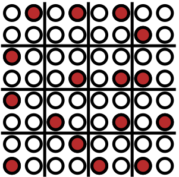

### Short description

Calculates the lattice thermal conductivity, including collective contribution and off-diagonal coherent term up to fourth-order interactions.

### Command line options:


Optional switches:

* `--readiso`  
    default value .false.  
    Read the isotope distribution from `infile.isotopes`. The format is specified [here](../files.md#infile.isotopes).

* `--qpoint_grid value#1 value#2 value#3`, `-qg value#1 value#2 value#3`  
    default value 26 26 26  
    Density of q-point mesh for Brillouin zone integrations.

* `--qpoint_grid3ph value#1 value#2 value#3`, `-qg3ph value#1 value#2 value#3`
    default value -1 -1 -1
    Dimension of the grid for the threephonon integration.

* `--qpoint_grid4ph value#1 value#2 value#3`, `-qg4ph value#1 value#2 value#3`
    default value -1 -1 -1
    Dimension of the grid for the fourphonon integration.

* `--integrationtype value`, `-it value`, value in: `1,2`  
    default value 2  
    Type of integration for the phonon DOS. 1 is Gaussian, 2 adaptive Gaussian.

* `--sigma value`  
    default value 1.0  
    Global scaling factor for adaptive Gaussian smearing.

* `--readqmesh`  
    default value .false.  
    Read the q-point mesh from file. To generate a q-mesh file, see the genkpoints utility.

* `--fourthorder`
    default value .false.
    Consider four-phonon contributions to the scattering.

* `--classical`
    default value .false.
    Use the classical limit for phonon occupation and heat capacity.

* `--temperature value`  
    default value 300
    Evaluate thermal conductivity at a single temperature.

* `--max_mfp value`  
    default value -1  
    Add a limit on the mean free path as an approximation of domain size.

* `--noisotope`  
    default value .false.  
    Do not consider isotope scattering.

* `--help`, `-h`  
    Print this help message

* `--version`, `-v`  
    Print version
### Examples

`mpirun thermal_conductivity_4ph --temperature 300` 

`mpirun thermal_conductivity_4ph -qg 30 30 30 --temperature 300 -qg3ph 15 15 15` 

`mpirun thermal_conductivity -qg 30 30 30 --qg3ph 15 15 15 -qg4ph 4 4 4` 

### Longer summary

The thermal conductivity tensor can be computed from the Green-Kubo formula

$$
\begin{equation}
\kappa^{\alpha\beta} = \frac{\beta}{V T} \int_0^\infty dt \int_0^\beta d\lambda \langle J_{\alpha}(i\hbar\lambda) J_\beta(t) \rangle
\end{equation}
$$

where $J_{\alpha}$ is the heat current operator.
In a crystal, the heat current operator can be approximated as

$$
\begin{equation}
J_{\alpha} = - \sum_{ij} \sum_{\beta\gamma} \big( \langle R_i^\alpha \rangle - \langle R_j^\alpha \rangle ) \Phi_{ij}^{\beta\gamma} u_i^\beta v_j^\gamma
\end{equation}
$$

which can be projected on phonons to give

$$
\begin{equation}
J_{\alpha} = \frac{1}{2}\sum_{\lambda \lambda'} \hbar \omega_{\lambda'} v_{\lambda\lambda'}^{\alpha} A_\lambda B_{\lambda'}
\end{equation}
$$

In this equation, $A_\lambda$ and $B_\lambda$ are respectively the displacements and momentum phonon operators and $v_{\lambda\lambda'}^{\alpha}$ is the generalized off-diagonal phonon group-velocity [^Dangic2021], written

$$
\begin{equation}
v_{\lambda\lambda'}^\alpha = \frac{i}{2 \sqrt{\omega_\lambda \omega_{\lambda'}}} \sum_{ij \beta\gamma} \epsilon_\lambda^{i\beta} \sum_{\mathbf{R}} \big( \langle R_i^\alpha \rangle - \langle R_j^\alpha \rangle \big) \frac{\Phi_{ij}^{\beta\gamma}}{\sqrt{m_i m_j}} \epsilon_{\lambda'}^{j\gamma}
\end{equation}
$$

and whose diagonal contributions are equal to the usual phonon group velocities $\mathbf{v}_{\lambda\lambda} = \mathbf{v}_{\lambda}$.
Now, the heat current can be separated in a diagonal and a non diagonal contribution as

$$
\begin{equation}
J_{\alpha} = J_{\alpha}^{\mathrm{d}} + J_{\alpha}^{\mathrm{nd}}
\end{equation}
$$

Here, we will only provide a sketch of the derivation.
For more informations, we refer reader to the article describing the implementation [^Castellano2024] and the references at the bottom of the page.


### Scattering rates

Before handling the thermal conductivity tensor, we will discuss the scattering rates of the phonons.
Due to interaction with other phonons or quasiparticles, isotopic disorder, boundaries, ..., the phonons scatters.
This scattering is encoded in the self-energy (or memory kernel).

Here, we will make the approximation that these interactions are weak enough so that we can work in the Markovian approximation (or equivalently apply Fermi's golden rule).
In this case, the self-energy can be simplified to a single number $\Gamma_\lambda$, which allows to define the phonon lifetime

$$
\begin{equation}
\tau_\lambda = \frac{1}{2 \Gamma_\lambda}
\end{equation}
$$

Within this approximation, the phonon spectral function $\chi''(\Omega)$ reduces to a Lorentzian centered on $\omega_\lambda$ with a width of $\Gamma_\lambda$.

The contribution to $\Gamma_\lambda$ given by third order interaction is written

$$
\begin{equation}
\begin{split}
\Gamma_\lambda^{3\mathrm{ph}} = \frac{\pi}{16} \sum_{\lambda' \lambda''} \vert \Psi_{\lambda\lambda'\lambda''} \vert^2  &\big[(n_{\lambda'} + n_{\lambda''} + 1) (\delta(\omega_\lambda - \omega_{\lambda'} - \omega_{\lambda''}) - (\delta(\omega_\lambda + \omega_{\lambda'} + \omega_{\lambda''})) \\
&+ (n_{\lambda'} - n_{\lambda''}) (\delta(\omega_\lambda + \omega_{\lambda'} - \omega_{\lambda''}) - (\delta(\omega_\lambda - \omega_{\lambda'} + \omega_{\lambda''})) \big]
\end{split}
\end{equation}
$$

with $n_\lambda = (e^{\hbar\omega_\lambda / k_{\mathrm{B}}T} - 1)^{-1}$ the Bose-Einstein distribution of phonon $\lambda$.
In this equation, the sum is over momentum conserving processes, $\mathbf{q} + \mathbf{q}' + \mathbf{q}'' = \mathbf{G}$ and the three-phonon matrix elements are given by

$$
\begin{equation}
\Psi_{\lambda\lambda'\lambda''} = \sum_{ijk} \sum_{\alpha\beta\gamma} \frac{\epsilon_{\lambda}^{i \alpha}\epsilon_{\lambda'}^{j \beta}\epsilon_{\lambda''}^{k \gamma}}
{\sqrt{m_{i}m_{j}m_{k}}\sqrt{\omega_{\lambda}\omega_{\lambda'}\omega_{\lambda''}}}\Phi^{\alpha\beta\gamma}_{ijk}e^{i \mathbf{q}\cdot\mathbf{r}_i + i \mathbf{q}'\cdot\mathbf{r}_j+i \mathbf{q}''\cdot\mathbf{r}_k}
\end{equation}
$$

At the fourth-order, the contribution is

$$
\begin{equation}
\begin{split}
\Gamma_\lambda^{4\mathrm{ph}} = \frac{\pi}{96} \sum_{\lambda'\lambda''\lambda'''} \vert \Psi_{\lambda\lambda'\lambda''\lambda'''} \vert^2
&\big[ (n_{\lambda'} + 1)(n_{\lambda''} + 1)(n_{\lambda'''} + 1) - n_{\lambda'}n_{\lambda''}n_{\lambda'''} (\delta(\omega_{\lambda} - \omega_{\lambda'} - \omega_{\lambda''} - \omega_{\lambda'''}) - \delta(\omega_{\lambda} + \omega_{\lambda'} + \omega_{\lambda''} + \omega_{\lambda'''})) \\
&+ 3 n_{\lambda'}(n_{\lambda''} + 1)(n_{\lambda'''} + 1) - (n_{\lambda'} + 1) n_{\lambda''}n_{\lambda'''} (\delta(\omega_{\lambda} + \omega_{\lambda'} - \omega_{\lambda''} - \omega_{\lambda'''}) - \delta(\omega_{\lambda} - \omega_{\lambda'} + \omega_{\lambda''} + \omega_{\lambda'''}))] 
\end{split}
\end{equation}
$$

where the sum is also over momentum conserving processes, $\mathbf{q} + \mathbf{q}' + \mathbf{q}'' + \mathbf{q}''' = \mathbf{G}$ and the four-phonon matrix elements are given by

$$
\begin{equation}
\Psi_{\lambda\lambda'\lambda''\lambda'''} = \sum_{ijkl} \sum_{\alpha\beta\gamma\delta} \frac{\epsilon_{\lambda}^{i \alpha}\epsilon_{\lambda'}^{j \beta}\epsilon_{\lambda''}^{k \gamma}\epsilon_{\lambda'''}^{l \delta}}
{\sqrt{m_{i}m_{j}m_{k}m_{l}}\sqrt{\omega_{\lambda}\omega_{\lambda'}\omega_{\lambda''}\omega_{\lambda'''}}}\Phi^{\alpha\beta\gamma\delta}_{ijkl}e^{i \mathbf{q}\cdot\mathbf{r}_i + i \mathbf{q}'\cdot\mathbf{r}_j+i \mathbf{q}''\cdot\mathbf{r}_k+i\mathbf{q}'''\cdot\mathbf{r}_l}
\end{equation}
$$

The contribution to the scattering rate by isotopic disorder can be computed to Tamura's model[^Tamura1983], written

$$
\begin{equation}
\Gamma_{\lambda}^{\mathrm{iso}} = \frac{\pi}{4} \sum_{\lambda'} \omega_{\lambda} \omega_{\lambda'} \sum_i g_i \vert \epsilon_\lambda^{i\dagger} \epsilon_{\lambda'}^{i} \vert \delta(\omega_{\lambda} - \omega_{\lambda'})
\end{equation}
$$

where the mass variance parameter $g$ is written

$$
\begin{equation}
g_i=\sum_j c_{i}^j \left(\frac{m_i^j-\bar{m_i}}{\bar{m_i}}\right)^2
\end{equation}
$$

In this equation, $\bar{m_i}$ is the average isotopic mass( $\bar{m_i}=\sum_j c_i^j m_i^j$ ), $m^j_i$ is the mass of isotope $j$ of atom $i$ and $c^j_i$ is its concentration.

Finally, scattering by domain boundaries is implemented as

$$
\begin{equation}
\Gamma_{\lambda}^{\mathrm{boundary}} = \frac{v_{\lambda}}{2 L}
\end{equation}
$$

where $L$ is a characteristic domain size.


### The diagonal contribution

The diagonal contribution to the heat current is written

$$
\begin{equation}
J_{\alpha}^{\mathrm{d}} = \sum_\lambda \hbar \omega_\lambda v_{\lambda}^{\alpha} A_\lambda B_\lambda
\end{equation}
$$

Injecting it into the Green-Kubo formula, we obtain that the thermal conductivity tensor is proportional to a four-point correlation

$$
\begin{equation}
\kappa_{\alpha\beta}^\mathrm{d} \propto \int_0^\infty dt \int_0^\beta d\lambda \langle A_\lambda(i\hbar\lambda) B_\lambda(i\hbar\lambda) A_{\lambda'}(t) B_{\lambda'}(t) \rangle
\end{equation}
$$

Solving the integral of this four-point correlation is a cumbersome task, and we refer the reader to references [^Fiorentino2023]<sup>,</sup>[^Castellano2024] for the detailed derivation.
In a nutshell, an equation of motion is formulated for the four-point correlation.
This equation of motion is then solved using a Laplace transform and injected in the thermal conductivity tensor to give

$$
\begin{equation}
\begin{split}
\kappa_{\alpha\beta}^{\mathrm{d}} =& \frac{1}{V} \sum_{\lambda\lambda'} v_{\lambda}^{\alpha} v_{\lambda}^{\beta} c_\lambda \Xi^{-1}({\lambda\lambda'}) \\
=& \frac{1}{V} \sum_{\lambda} c_\lambda v_{\lambda}^{\alpha} F_{\lambda\beta}
\end{split}
\end{equation}
$$

with $c_\lambda = n_\lambda (n_\lambda + 1) \omega_\lambda^2 / k_{\mathrm{B}}T^2$ and where the vector $F_{\lambda}^{\beta}$, defined as

$$
\begin{equation}
F_{\lambda\alpha} = \Xi^{-1} v_{\lambda}^{\alpha}
\end{equation}
$$

is simply introduced to ease the computation of the thermal conductivity tensor.

In the previous equation, $\Xi$ is called the scattering matrix.
The diagonal component of this matrix is equal to the scattering rates $\Gamma_\lambda$ of phonons while the off-diagonal part describes the coupling between modes, which introduce collective phonon contributions to heat transport.

Using the Neumann series for matrix inversion, $F_{\lambda}^{\alpha}$ can be computed self-consistently [^Omini]<sup>,</sup>[^Omini1996] as

$$
\begin{equation}
F_{\lambda\alpha}^{n+1} = F_{\lambda\alpha}^0 - \tau_\lambda \sum_{\lambda'} \Xi_{\lambda\lambda'} F_{\lambda\alpha}^n
\end{equation}
$$

where the starting point is given by

$$
\begin{equation}
F_{\lambda\alpha}^0 = v_{\lambda}^{\alpha} \tau_{\lambda\alpha}
\end{equation}
$$

If the off-diagonal part of the scattering matrix are neglected, one obtain the single mode approximation, written

$$
\begin{equation}
\kappa_{\alpha\beta}^{\mathrm{d},\mathrm{SMA}} = \frac{1}{V} \sum_{\lambda\lambda'} v_{\lambda}^{\alpha} v_{\lambda}^{\beta} c_\lambda \tau_\lambda
\end{equation}
$$

This approximation consists in neglecting the collective phonon contribution to the thermal conductivity tensor and can also be obtain by decoupling the four-point correlation in product of two-point correlation.

It is important to note that while starting from differents considerations, this formulation and the Boltzmann equation [^peierls1929]<sup>,</sup>[^peierls1955quantum]<sup>,</sup>[^Broido2007]<sup>,</sup>[^Broido2005] are strictly equivalent [^Fiorentino2023].


### The off-diagonal coherent contribution

The off diagonal heat tensor is written

$$
\begin{equation}
J_{\alpha}^{\mathrm{nd}} = \sum'_{\lambda \lambda'} \hbar \omega_{\lambda'} v_{\lambda\lambda'}^{\alpha} A_\lambda B_{\lambda'}
\end{equation}
$$

where $\sum'$ indicates that $\lambda = \lambda'$ is excluded from the sum.
Injecting this contribution into the Green-Kubo formula also ends up in something proportional to a four-point correlation function

$$
\begin{equation}
\kappa_{\alpha\beta}^\mathrm{nd} \propto \int_0^\infty dt \int_0^\beta d\lambda \langle A_{\lambda}(i\hbar\lambda) B_{\lambda'}(i\hbar\lambda) A_{\lambda''}(t) B_{\lambda'''}(t) \rangle
\end{equation}
$$

For this contribution, we will directly neglect the collective part and decouple the four-point correlation in product of two-point correlations

$$
\begin{equation}
\langle A_{\lambda} B_{\lambda'} A_{\lambda''} B_{\lambda'''} \rangle \approx \langle A_{\lambda} A_{\lambda''} \rangle \langle B_{\lambda'} B_{\lambda'''} \rangle + ...
\end{equation}
$$

Performing some Fourier transform, we can now express the integral in term of spectral function $\chi_{\lambda}''(\Omega)$

$$
\begin{equation}
\int_0^\infty dt \int_0^\beta d\lambda \langle A_{\lambda}(i\hbar\lambda) B_{\lambda'}(i\hbar\lambda) A_{\lambda''}(t) B_{\lambda'''}(t) \rangle \approx \int_{-\infty}^{\infty} d\Omega \chi_{\lambda}''(\Omega) \chi_{\lambda'}''(\Omega) \Omega^2 n(\Omega) (n(\Omega) + 1)
\end{equation}
$$

Recalling that we are working in the Markovian approximation, we can approximate these spectral functions as Lorentzian, and we can make the approximation that these will act as Dirac deltas centered on the harmonic frequencies.
This allows to perform the integral analytically, and we finally obtain the off diagonal contribution to the thermal conductivity tensor as

$$
\begin{equation}
\kappa_{\alpha\beta}^{\mathrm{nd}} = \frac{1}{V} \sum_{\lambda\lambda'} v_{\lambda\lambda'}^{\alpha}v_{\lambda\lambda'}^{\beta} \frac{c_\lambda + c_{\lambda'}}{2} \Gamma_{\lambda\lambda'}
\end{equation}
$$

with

$$
\begin{equation}
\Gamma_{\lambda\lambda'} = \frac{\Gamma_\lambda + \Gamma_{\lambda'}}{(\omega_\lambda - \omega_{\lambda'})^2 + (\Gamma_\lambda + \Gamma_{\lambda'})^2}
\end{equation}
$$

This off-diagonal contribution, describing wavelike-interference between phonons of similar frequencies, becomes important for system with complex unitcell.
While the derivation sketched here is based on the Hardy current[^Isaeva2019], it can also be obtain from a Wigner description of heat transport [^Simoncelli2019], with very similar results[^Caldarelli2022].

### Monte-Carlo integration for the scattering rates

To reach the thermodynamic limit, the thermal conductivity has to be computed on a large grid of q-points, which can make the computation quite expensive.
This cost comes almost entirely from the computation of the scattering.

However, one can observe that the computation of $\kappa$ actually requires two kind of integrations.
The first is the sum of the contribution of each q-point to the thermal conductivity, while the second one correspond to the computation of the scattering.

Fortunately for us, these two integrations converges at different rates.
In particular, the expensive scattering integration converges more quickly than the thermal conductivity integration.

Thus, to improve the computational cost, the code offers the possibility to decouple these two integrations by using a Monte-Carlo integration of the scattering.
For this, we generate a full grid, on which the thermal conductivity will be integrated.
A subset of this full grid can then be selected to perform the scattering integration.
In order to improve the convergence, these point are not selected entirely at random but using a stratified approached in order to sample more uniformly the Brillouin zone.

This is schematically represented in the following picture, where each dot represents a point on a $8\times8$ grid, with the red dot corresponding to point selected for a Monte-Carlo integration equivalent to a $4\times4$ grid and the bar representing the way the grid is stratified.

<center>

</center>

The code allows to use different Monte-Carlo grids for third and fourth order, using the variables `--qpoint_grid3ph` and `--qpoint_grid4ph`.

It is important to note that since the points are selected randomly, the results will be noisy.
However, the noise reduces as the density of the Monte-Carlo grids increases, to finally vanish if the Monte-Carlo and full grid density are the same (which is the default).
Similarly to the full grid on which the thermal conductivity is computed, the Monte-Carlo grid densities are parameters to be carefully converged.


### Input files

These files are necesarry:

* [infile.ucposcar](../files.md#infile.ucposcar)
* [infile.forceconstant](extract_forceconstants.md#infile.forceconstant)
* [infile.forceconstant_thirdorder](extract_forceconstants.md#infile.forceconstant_thirdorder)

and these are optional:

* [infile.isotopes](../files.md#infile.isotopes) (for non-natural isotope distribution)
* [infile.forceconstant_fourthorder](extract_forceconstants.md#infile.forceconstant_fourthorder)

### Output files

### `outfile.thermal_conductivity_4ph`

This file contains the thermal conductivity tensor, with the decomposition from all contributions, in a format that can be parsed with tools such as numpy.
It looks like this

```
# Unit:               W/m/K
# Temperature:          0.300000000000E+03
# Single mode relaxation time approximation
#                      kxx                      kyy                      kzz                      kxy                      kxz                      kyz
        0.769173980296E+02       0.769173980296E+02       0.769173980296E+02       0.000000000000E+00       0.000000000000E+00       0.000000000000E+00
# Collective contribution
#                      kxx                      kyy                      kzz                      kxy                      kxz                      kyz
        0.222791455811E+01       0.222791455811E+01       0.222791455811E+01       0.000000000000E+00       0.000000000000E+00       0.000000000000E+00
# Off diagonal coherent contribution
#                      kxx                      kyy                      kzz                      kxy                      kxz                      kyz
        0.323145325119E-02       0.323145325119E-02       0.323145325119E-02       0.000000000000E+00       0.000000000000E+00       0.000000000000E+00
# Total thermal conductivity
#                      kxx                      kyy                      kzz                      kxy                      kxz                      kyz
        0.791485440410E+02       0.791485440410E+02       0.791485440410E+02       0.000000000000E+00       0.000000000000E+00       0.000000000000E+00
```


#### `outfile.grid_thermal_conductivity_4ph.hdf5`

This file contains nearly all quantities on the full q-grid.
Below is a matlab snippet that plots a subset:

```matlab

% file to read from
fn='outfile.grid_thermal_conductivity.hdf5';
% convert units to THz from Hz?
toTHz=1/1E12/2/pi;

figure(1); clf; hold on;

subplot(1,3,1); hold on; box on;

    x=h5read(fn,'/frequencies');
    y=h5read(fn,'/linewidths');

    for i=1:size(x,1)
        plot(x(i,:)*toTHz,y(i,:)*toTHz,'marker','.','linestyle','none','markersize',8)
    end
    set(gca,'xminortick','on','yminortick','on')
    xlabel('Frequency (THz)')
    ylabel('Linewidth (THz)')

subplot(1,3,2); hold on; box on;

    x=h5read(fn,'/frequencies');
    y=h5read(fn,'/lifetimes');

    for i=1:size(x,1)
        plot(x(i,:)*toTHz,y(i,:),'marker','.','linestyle','none','markersize',8)
    end
    set(gca,'yscale','log','xminortick','on')
    xlabel('Frequency (THz)')
    ylabel('Lifetime (s)')

subplot(1,3,3); hold on; box on;

    x=h5read(fn,'/frequencies');
    y=h5read(fn,'/mean_free_paths');

    for i=1:size(x,1)
        plot(x(i,:)*toTHz,y(i,:),'marker','.','linestyle','none','markersize',8)
    end
    set(gca,'yscale','log','xminortick','on')
    xlabel('Frequency (THz)')
    ylabel('Mean free paths (m)')

```

[^Castellano2024]: Castellano, A & Batista, J. P. & Verstraete, M. J. (2024). Temperature generalization of thermal transport in anharmonic crystals: theory and efficient implementation. ArXiv

[^peierls1929]: Peierls, R. E. (1929). Annalen der Physik, 3, 1055

[^peierls1955quantum]: [Peierls, R. E. (1955). Quantum Theory of Solids. Clarendon Press.](https://books.google.com/books?id=WvPcBUsSJBAC)

[^Tamura1983]: [Tamura, S. (1983). Isotope scattering of dispersive phonons in Ge. Physical Review B, 27(2), 858–866.](http://doi.org/10.1103/PhysRevB.27.858)

[^Omini1996]: [Omini, M., & Sparavigna, A. (1996). Beyond the isotropic-model approximation in the theory of thermal conductivity. Physical Review B, 53(14), 9064–9073.](http://doi.org/10.1103/PhysRevB.53.9064)

[^Omini]: [Omini, M., & Sparavigna, A. (1997). Heat transport in dielectric solids with diamond structure. Nuovo Cimento Della Societa Italiana Di Fisica D, 19D, 1537–63.](http://www.sif.it/riviste/ncd/econtents/1997/019/10/article/5)

[^Broido2007]: [Broido, D. A., Malorny, M., Birner, G., Mingo, N., & Stewart, D. A. (2007). Intrinsic lattice thermal conductivity of semiconductors from first principles. Applied Physics Letters, 91(23), 231922.](http://doi.org/10.1063/1.2822891)

[^Broido2005]: [Broido, D. A., Ward, A., & Mingo, N. (2005). Lattice thermal conductivity of silicon from empirical interatomic potentials. Physical Review B, 72(1), 1–8.](http://doi.org/10.1103/PhysRevB.72.014308)

[^Isaeva2019]: [Isaeva, L & Barbalinardo, G. & Donadio, D. & Baroni, S. (2019). Modeling heat transport in crystals and glasses from a unified lattice-dynamical approach. Nature Communications 10 3853](https://doi.org/10.1038/s41467-019-11572-4)

[^Fiorentino2023]: [Fiorentino, A. & Baroni, S (2023). From Green-Kubo to the full Boltzmann kinetic approach to heat transport in crystals and glasses. Physical Review B, 107, 054311](https://doi.org/10.1103/PhysRevB.107.054311)

[^Simoncelli2019]: [Simoncelli, M. & Marzari, N. & Mauri, F. (2019). Unified theory of thermal transport in crystals and glasses. Nature physics 15 803-819](https://doi.org/10.1038/s41567-019-0520-x)

[^Caldarelli2022]: [Caldarelli, G. & Simoncelli, M. & Marzari, N. & Mauri, F. & Benfatto, L. (2022). Many-body Green's function approach to lattice thermal transport. Physical Review B 106 024312](https://doi.org/10.1103/PhysRevB.106.024312)

[^Dangic2021]: [Dangić, Đ. & Hellman, O. & Fahy, S. and Savić, I. (2021) The origin of the lattice thermal conductivity enhancement at the ferroelectric phase transition in GeTe. Nature Computational Materials 7, 57](https://doi.org/10.1038/s41524-021-00523-7)
