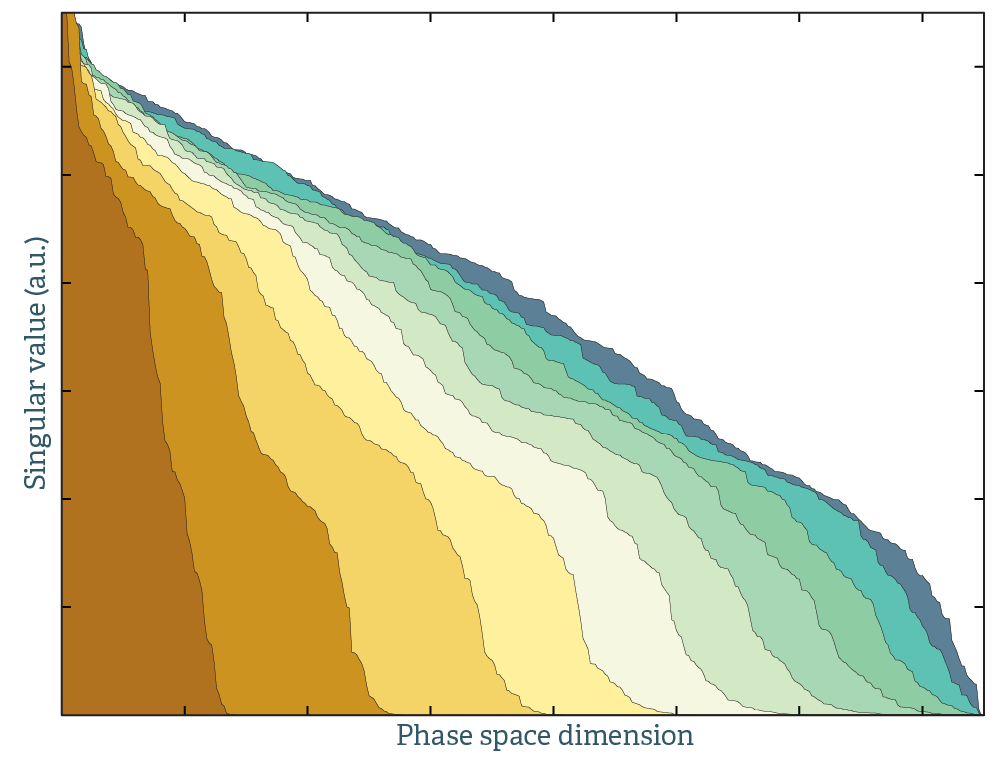

author: Olle Hellman
display: none
graph: none
propname: canonical configuration
propnamelink: <a href="../program/canonical_configuration.html">canonical configuration</a>
{!man/canonical_configuration.md!}

### What can this code produce

@todo Schematic picture that build configurations.

### Longer summary

@todo Check options for output format, think wrong order.

@todo Explain averages

@todo Add heat capacity calculation to the code? Make a running average to compare with the analytical.

@todo At the end of the code, measure average energy and compare with the analytical number.

This code takes a second order [forceconstant](extract_forceconstants.html) and generates a supercell with the atoms displaced corresponding to a harmonic canonical ensemble. These configurations can be used directly, to generate force-displacement statistics to determine force constants and other thermal properties, or as the starting point for molecular dynamics.

### Background

Born-Oppenheimer molecular dynamics can be expensive for many reasons. Firstly, it requires supercells with more than 100 atoms. Secondly, computation of the electronic ground state at every time step is time consuming. Thirdly, the cell must be fully equilibrated. The precision of the calculations is statistically linked to the number of configurations used: any property $A$ for which we want to calculate the ensemble average $\langle A \rangle$ must be converged with respect to the number of uncorrelated time steps.

To minimize the equilibration time, the simulation cell can be initialized to a thermally excited state by selecting initial atomic velocities and displacement amplitudes according to the Maxwell-Boltzmann[^West2006] or Bose - Einstein distributions.

Starting with the equations of motion for the supercell (given harmonic [force constants](../program/extract_forceconstants.html))

$$
\begin{equation}
\begin{pmatrix}
m_1 \ddot{\mathbf{u}}_1 \\
m_2 \ddot{\mathbf{u}}_2 \\
\vdots \\
m_{N_a} \ddot{\mathbf{u}}_{N_a}
\end{pmatrix}=
\begin{pmatrix}
\mathbf{\Phi}_{11} & \mathbf{\Phi}_{12} & \cdots & \mathbf{\Phi}_{1N_a} \\
\mathbf{\Phi}_{21} & \mathbf{\Phi}_{22} & \cdots & \mathbf{\Phi}_{2N_a} \\
\vdots & \vdots & \ddots & \vdots \\
\mathbf{\Phi}_{N_a1} & \mathbf{\Phi}_{N_a2} & \cdots & \mathbf{\Phi}_{N_aN_a}
\end{pmatrix}
\begin{pmatrix}
\mathbf{u}_1\\
\mathbf{u}_2 \\
\vdots \\
\mathbf{u}_{N_a} \\
\end{pmatrix}
\end{equation}
$$

we diagonalise these and get obtaining $3N_a$ eigenvalues $\omega^2_s$ and eigenvectors $\epsilon_s$. In the given cell, we can use this normal mode transformation to express the instantaneous positions and velocities,

$$
\begin{align}
u_i = & \sum_{s=1}^{3N_a} \epsilon_{is} A_{is} \sin( \omega_s t+\delta_s ) \\
\dot{u}_i = & \sum_{s=1}^{3N_a} \epsilon_{is} A_{is} \omega_s \cos( \omega_s t+\delta_s)
\end{align}
$$

This is identical to the transformation introduced in [phonon dispersion relations](phonon_dispersion_relations.html), except that the masses are incorporated in the normal mode amplitudes. We also omit the choice of $\mathbf{q}$-vector, since we are only interested in the modes that are commensurate with the supercell. This leads to the dynamical matrix being a real symmetric matrix, with real eigenvalues and real eigenvectors.

The normal mode amplitudes $A_s$ and the phase $\delta_s$ will be determined by the following boundary conditions: we require a set of positions and velocities that correspond to a canonical ensemble. We choose $A_s$ so that they are normally distributed around their mean value and that each mode $s$ should contribute, on average, $k_B T/2$ to the internal energy. Then

$$
\begin{equation}
\langle A_{is} \rangle =
\sqrt{\frac{\hbar (2n_s+1) }{2 m_i \omega_s}}
\approx
\frac{1}{\omega_s}\sqrt{\frac{k_BT}{m_i}},
\end{equation}
$$

where the approximate result is in the classical limit, $\hbar \omega \ll k_BT $. The appropriate distribution of atomic positions and velocities is given by,

$$
\begin{align}
u_i & = \sum_{s=1}^{3N_a}
\epsilon_{is} \langle A_{is} \rangle \sqrt{-2\ln \xi_1}\sin 2\pi\xi_2 \\
\dot{u}_i & = \sum_{s=1}^{3N_a}
\omega_s \epsilon_{is} \langle A_{is} \rangle \sqrt{-2\ln \xi_1}\cos 2\pi\xi_2
\end{align}
$$

Here, $0 \lt \xi_n \lt 1$, represents a uniform distribution of random numbers, which are transformed to a normal distribution using the standard Box-Muller transform.

Choosing the mean amplitudes in the classical limit gives us a snapshot in time from a canonical Maxwell-Boltzmann ensemble (within the harmonic approximation), which results in a starting point that reduces the time until equilibration by orders of magnitude. Choosing a Bose-Einstein distribution of mean amplitudes and velocities instead allows us to sample phase space while including quantum thermal disorder at low temperatures.

For applications where one does not need consecutive timesteps, the starting configurations generated by this can be used  by run several simultaneous instances of Born-Oppenheimer molecular dynamics with different random starting configurations, rather than running a single long instance. This strategy allows for parallelization of Born-Oppenheimer molecular dynamics with near perfect linear scaling, since the overhead of equilibration time is almost completely eliminated.

This is illustrated in the plot above. This is the singular value decomposition of molecular dynamics trajectories. A single colored field corresponds to data from a single random initial starting configuration. The dimensions spanned per unit time is greatly increased by stitching together calculations from different initial configurations. That is, 10 MD runs of 1000 time steps explores phase space better than a single MD run of 10x1000 time steps.

#### Matching with a Debye temperature

Up until this point we have assumed you have [forceconstants](extract_forceconstants.html) to generate the normal mode displacements. If you don't, it's possible to guess them. The following procedure is used: assume a pair potential $U(r)$ which obeys

$$
\begin{equation}
\frac{ \partial U(r)}{\partial r_{ij} }=0
\end{equation}
$$

and

$$
\begin{equation}
\frac{ \partial^2 U(r)}{\partial r_{ij}^2 }=\frac{\alpha}{r_{ij}^4}
\end{equation}
$$

Here $r_{ij}$ is a pair distance in the supercell. Forceconstants can be calculated analytically from a pair potential, in this case they are given by

$$
\begin{equation}
\mathbf{\Phi}(r)=
-\frac{\alpha}{r^6}
\begin{pmatrix}
r_x^2 & r_x r_y & r_x r_z \\
r_x r_y & r_y^2 & r_y r_z \\
r_x r_z & r_y r_z & r_z^2  
\end{pmatrix}
\end{equation}
$$

By definition, this will always produce stable phonons with the correct symmetry. The parameter $\alpha$ is determined by numerically matching the zero-point motion of the phonons to a Debye temperature (option `--debyte_temperature`):

$$
\begin{equation}
\frac{1}{N} \sum_i \frac{\hbar \omega_i(\alpha)}{2} = \frac{9 k_B T_D}{8}
\end{equation}
$$

Or alternatively matching the maximum frequency to a reference value (option `--maximum_frequency`). Using actual forceconstants is of course better, but this procedure generates surprisingly good configurations.

### Stochastic sampling

The thermalized samples produced by this code can be used to obtain finite-temperature interatomic force constants directly. A small tutorial is provided [here](../page/workflows/minimal_example_3.html).

@todo Create the tutorial for fast stochastic simulations.

### Input files

* [infile.ucposcar](../page/files.html#infile.ucposcar)
* [infile.ssposcar](../page/files.html#infile.ucposcar) (use [generate structure](generate_structure.html) to create one)
* [infile.forceconstant](../page/files.html#infile.forceconstant) (or use `--debye_temperature` as described above)

### Output files

The desired number of configurations are printed in VASP POSCAR [format](../page/files.html#infile.ucposcar) by default, but the `--output_format` option can provide output in a variety of formats.

* contcar_conf0001
* contcar_conf0002
* contcar_conf0003
* ...

In case you used a Debye temperature to generate the configurations, `outfile.fakeforceconstant` will be written. Use [phonon dispersion relations](phonon_dispersion_relations.html) to plot it and check that the frequencies are reasonable.

[^West2006]: [West, D., & Estreicher, S. (2006). First-Principles Calculations of Vibrational Lifetimes and Decay Channels: Hydrogen-Related Modes in Si. Physical Review Letters, 96(11), 115504.](http://doi.org/10.1103/PhysRevLett.96.115504)
