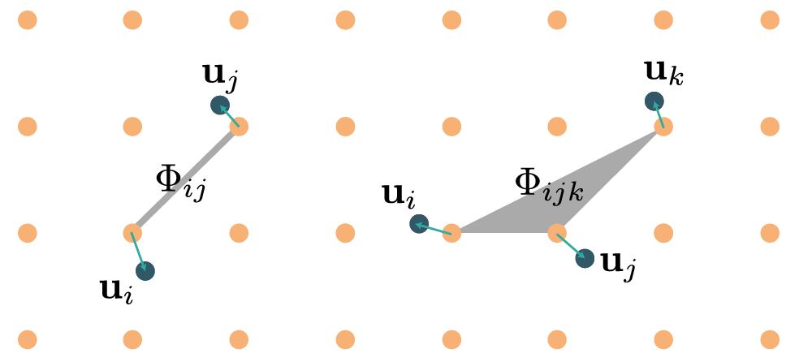

### Longer summary

Calculations of the interatomic force constants are the most important part of any lattice dynamics calculation as they are used to calculate many micro and macroscopic properties of the system, e.g. phonon, thermodynamic, and transport properties, etc. This codes takes sets of displacements and forces, and uses these to fit the coefficients in an effective lattice dynamical Hamiltonian. This is by no means a new idea.[^Klein1972] The main advantage of the TDEP method is in the implementation: it is numerically robust, well tested and general. It is not limited in order, nor limited to simple ordered systems.

### Model Hamiltonians

### Lattice dynamics and interatomic force constants

A quick recap of lattice dynamical theory:[^Born1998] a displacement $\mathbf{u}$ of an atom $i$ from its ideal lattice position changes the potential energy of the lattice. Temperature disorders the lattice, causing all atoms to be displaced from their equilibrium positions; this effect can be modeled as a Taylor expansion of the potential energy contribution of the instantaneous positions of the atoms in the system, i.e. $U=U(\{ \mathbf{r} \})$. It is convenient to define the atomic positions as displacements $\mathbf{u}$ from their equilibrium positions $\mathbf{R}_i+\boldsymbol{\tau}_i$.

$$
\begin{equation}
\textbf{r}_i=\mathbf{R}_i+\boldsymbol{\tau}_i+\mathbf{u}_i.
\end{equation}
$$

$\mathbf{R}_i$ is a lattice vector and $\boldsymbol{\tau}_i$ is the position in the unit cell. We can then expand the potential energy in terms of displacements as:

$$
\begin{equation}
\begin{split}
U(\{\textbf{u}\})=& U_0+
\sum_{i}\sum_\alpha
\Phi^\alpha_{i} u^\alpha_{i} +
\frac{1}{2!} \sum_{ij} \sum_{\alpha\beta} \Phi^{\alpha\beta}_{ij} u^\alpha_{i} u^\beta_{j} + \\
 + & \frac{1}{3!} \sum_{ijk} \sum_{\alpha\beta\gamma} \Phi^{\alpha\beta\gamma}_{ijk} u^\alpha_{i} u^\beta_{j} u^\gamma_{k}+
\frac{1}{4!} \sum_{ijkl} \sum_{\alpha\beta\gamma\delta} \Phi^{\alpha\beta\gamma\delta}_{ijkl} u^\alpha_{i} u^\beta_{j} u^\gamma_{k} u^\delta_{l} + \ldots
 \end{split}
\end{equation}
$$

Here, $\alpha\beta\gamma\delta$ are Cartesian indices and $U_0$ is the potential energy of the static lattice. The coefficients of the Taylor expansion are the derivatives of the potential energy with respect to displacement and are called the Born-von Kàrmàn force constants, which can be expressed as tensors of increasing rank:

$$
\begin{align}
\Phi^\alpha_i & = \left. \frac{\partial U}{\partial u_i^\alpha} \right|_{u=0} = 0 \\
\Phi^{\alpha\beta}_{ij} & = \left. \frac{\partial^2 U}{\partial u_i^\alpha \partial u_j^\beta} \right|_{u=0} \\
\Phi^{\alpha\beta\gamma}_{ijk} & = \left. \frac{\partial^3 U}{\partial u_i^\alpha \partial u_j^\beta \partial u_k^\gamma} \right|_{u=0} \\
\Phi^{\alpha\beta\gamma\delta}_{ijkl} & = \left. \frac{\partial^4 U}{\partial u_i^\alpha \partial u_j^\beta \partial u_k^\gamma \partial u_l^\delta} \right|_{u=0}
\end{align}
$$

By increasing rank, the force constants of rank $n$ represent $n$-body interactions, as illustrated in the diagram below:

<center>

</center>


### Force constant symmetries

Symmetry analysis allows us to greatly reduce the number of values needed to express the force constants (by multiple orders of magnitude, discussed more below) and is therefore crucial for generalizing the TDEP to include higher order terms in the potential energy surface. The symmetries of the force constants are deduced from rotational and translational invariance of the system, in addition to the symmetries of the crystal itself. We start with the transposition symmetries, which is an invariance under the permutation of the indices:[^Leibfried1961][^Maradudin1968]

$$
\begin{align}
\Phi_{ij}^{\alpha\beta} & = \Phi_{ji}^{\beta\alpha} \\
\Phi_{ijk}^{\alpha\beta\gamma} & = \Phi_{jik}^{\beta\alpha\gamma} = \ldots \\
\Phi_{ijkl}^{\alpha\beta\gamma\delta} & = \Phi_{jikl}^{\alpha\beta\gamma\delta} = \ldots
\end{align}
$$

All lattices belong to one of the 230 lattice space groups. The force constants should be invariant under these symmetry operations. If two tensors are related by symmetry operation $S$ their components are related as follows:

$$
\begin{align}
\Phi_{ij}^{\alpha\beta} &=
\sum_{\mu\nu}\Phi_{kl}^{\mu\nu}
S^{\mu\alpha}S^{\nu\beta}  \\
\Phi_{ijk}^{\alpha\beta\gamma} &=
\sum_{\mu\nu\xi}\Phi_{mno}^{\mu\nu\xi}
S^{\mu\alpha} S^{\nu\beta} S^{\xi\gamma}\\
\Phi_{ijkl}^{\alpha\beta\gamma\delta} &=
\sum_{\mu\nu\xi\kappa}\Phi_{mnop}^{\mu\nu\xi\kappa}
S^{\mu\alpha} S^{\nu\beta} S^{\xi\gamma} S^{\kappa\delta} \,.\\
\end{align}
$$

where $S^{\alpha\beta}$ is the proper or improper rotation matrix of the symmetry operation $S$. Naturally, this will also enforce the periodic nature of the lattice. Force constants also obey the translational invariance (acoustic sum rules):

$$
\begin{align}
\sum_j \mathbf{\Phi}_{ij} & =0 \quad \forall\, i \\
\sum_k \mathbf{\Phi}_{ijk} & =0 \quad \forall\, i,j \\
\sum_l \mathbf{\Phi}_{ijkl} & =0 \quad \forall\, i,j,k
\end{align}
$$

The rotational invariance gives

$$
\begin{align}
\sum_i \Phi_i^\alpha r_i^\beta & = \sum_i \Phi_i^\beta r_i^\alpha \quad \forall \, \alpha,\beta \\
\sum_j \Phi_{ij}^{\alpha\beta} r_j^\gamma + \Phi_i^\beta \delta_{\alpha\gamma} & =
\sum_j \Phi_{ij}^{\alpha\gamma} r_j^\beta + \Phi_i^\gamma \delta_{\alpha\beta}
\quad \forall \, \alpha,\beta,\gamma \\
\sum_k \Phi_{ijk}^{\alpha\beta\gamma}r_k^\lambda +  \Phi_{ij}^{\gamma\beta} \delta_{\alpha\lambda} + \Phi_{ij}^{\alpha\gamma} \delta_{\beta\lambda} &=
\sum_k \Phi_{ijk}^{\alpha\beta\lambda}r_k^\gamma +  \Phi_{ij}^{\lambda\beta} \delta_{\alpha\gamma} + \Phi_{ij}^{\alpha\lambda} \delta_{\beta\gamma}
\quad \forall \, \alpha,\beta,\gamma,\lambda \\
\end{align}
$$

And finally, the Huang invariances

$$
\begin{align}
[\alpha\beta,\gamma\lambda] & = \sum_{ij} \Phi_{ij}^{\alpha\beta} r_{ij}^\gamma r_{ij}^\lambda \\
[\alpha\beta,\gamma\lambda] & = [\gamma\lambda,\alpha\beta]
\end{align}
$$

ensure that the second order forceconstants, when taken to the long-wavelength limit, result in the correct number of elastic constants. For low-symmetry crystals the Hermitian character of the dynamical matrix is enforced:[^Martin1971][^Scheringer1974]

$$
\begin{equation}
	\sum_{j \ne i} \Phi^{\alpha\beta}_{ij} = \sum_{j \ne i} \Phi^{\beta\alpha}_{ij} \quad \forall\, i
\end{equation}
$$

All the symmetry relations above are naturally satisfied by the force constants produced by this code. In particular, the rotational, Huang and Hermitian invariances are rarely enforced in the literature, but are crucial for a correct behavior.

@note A word of caution for low-dimensional systems: the Huang invariances do not apply there. Consider graphene, it is difficult to define an elastic constant that corresponds to compression along the z-axis in a meaningful way. The short term solution is to temporarily switch them off via  the option `--nohuang`. The long term solution is to derive the proper invariances for a two-dimensional material, something I have not had the time to do.

### Effective Hamiltonian

The traditional lattice dynamical Hamiltonian described above has severe limitations, in that it's deduced from the derivatives of zero temperature configuration of the crystal. The form of the Hamiltonian is however beneficial: the second order forceconstants produce an exactly solvable Hamiltonian and with phonon quasiparticles, and the higher order terms can be treated as perturbations. To extend the usefulness of this Hamiltonian, we give up the constraint that the force constants are derivatives of the zero temperature configurations. Instead, the force constant tensors are just parameters in an effective Hamiltonian that are left to be determined.

Schematically, self-consistent or effective phonon theories can be split into two parts: the first part is revolves around how to sample the Born-Oppenheimer surface, the second part around how to use that data to produce an effective Hamiltonian.


#### Sampling phase space

The most straightforward way to sample the Born-Oppenheimer surface is to use molecular dynamics. This can be costly, although I provided some tools to make it faster: parallelizing over different random seeds combined with selective upsampling certainly makes it feasible. For systems with significant nuclear quantum effects, path integral molecular dynamics is preferred. The cost of these can be quite significant, but similar acceleration techniques can be used.

If you care predominantly about speed, stochastic sampling might be preferred. The way the Born-Oppenheimer surface is sampled does not influence the TDEP algorithms in any way. I even consider stochastic sampling using the zero-point the preferred way of calculating the true zero temperature force constants. The only thing required of the sampling is that it provides a set of forces, $\mathbf{f}^{\textrm{BO}}$, and displacements $\mathbf{u}$.

#### Obtaining an effective Hamiltonian

The basic premise is to use a model Hamiltonian (where orders beyond pair interactions are optional) given by

$$
\begin{equation}\label{eq:hamiltonian}
\hat{H}= U_0+\sum_i \frac{\textbf{p}_i^2}{2m_i}+
\frac{1}{2!}\sum_{ij} \sum_{\alpha\beta}\Phi_{ij}^{\alpha\beta}
u_i^\alpha u_j^\beta +\frac{1}{3!}
\sum_{ijk} \sum_{\alpha\beta\gamma}\Phi_{ijk}^{\alpha\beta\gamma}
u_i^\alpha u_j^\beta u_k^\gamma \ldots
\end{equation}
$$

and match the forces of the model, $\mathbf{f}^{\textrm{M}}$ to $\mathbf{f}^{\textrm{BO}}$.[^Hellman2013]<sup>,</sup>[^Hellman2013a]<sup>,</sup>[^Hellman2011] A brute force minimization is certainly possible, but the current implementation is a bit more sophisticated. The forces of the model Hamiltonian are given by

$$
\begin{equation}
f^{\mathrm{M}}_{i\alpha}=
-\sum_{j\beta}\Phi_{ij}^{\alpha\beta}u_j^\beta
-\frac{1}{2}\sum_{jk\beta\gamma}\Phi_{ijk}^{\alpha\beta\gamma}u_j^\beta u_k^\gamma + \ldots
\end{equation}
$$

To exploit the symmetry relations, we populate each tensor component with a symbolic variable, called $\theta$. The index $k$ runs from 1 to the total number of components in all tensors. We include all tensors within a cutoff radius $\textbf{r}_c$ (the maximum cutoff is determined by the simulation cell size). Using symmetries we figure out which tensor components are unique by accounting for those components that are either 0 or equal to another tensor component. This drastically reduces the number of values that have to be determined. With the symmetry irreducible representation at hand, we express the forces in the model Hamiltonian:

$$
\begin{equation}
f^{\mathrm{M}}_{i\alpha}=
\sum_k \theta_k c_k^{i\alpha}(\mathbf{U}).
\end{equation}
$$

Here $c_k^{i\alpha}(\mathbf{U})$, the coefficient for each $\theta_k$ is a polynomial function of all displacements within $\textbf{R}_c$. The form of this function depends on the crystal at hand (see the minimal example below). For a given supercell, we can express the vector of all forces in the cell as a matrix product:

$$
\begin{equation}
\underbrace{\mathbf{F}^{\mathrm{M}}}_{3N_a \times 1}=
\underbrace{\mathbf{C}(\mathbf{u})}_{3N_a \times N_{\theta}}
\underbrace{\mathbf{\Theta}}_{N_{\theta} \times 1}
\end{equation}
$$

where the underbraces denote size of the matrices. The coefficient matrix $\mathbf{C}$ is a function of all the displacements in the supercell. $\mathbf{\Theta}$ is a vector holding all the $\theta_k$. Then we seek the $\mathbf{\Theta}$ that minimizes the difference between the model system and the _ab initio_ one:

$$
\begin{equation}
\begin{split}
\min_{\Theta}\Delta \mathbf{F} & =
\frac{1}{N_c} \sum_{c=1}^{N_c}  \left| \mathbf{F}_c^{\textrm{BO}}-\mathbf{F}_c^{\textrm{M}} \right|^2= \\
& =\frac{1}{N_c} \sum_{c=1}^{N_c} \left| \mathbf{F}_c^{\textrm{BO}}-\mathbf{C}(\mathbf{u}_{c})\mathbf{\Theta} \right|^2 = \\
& = \frac{1}{N_c} \left\Vert
\begin{pmatrix} \mathbf{F}_1^{\textrm{BO}} \\  \vdots \\ \mathbf{F}_{N_c}^{\textrm{BO}} \end{pmatrix}-
\begin{pmatrix} \mathbf{C}(\mathbf{u}_1) \\ \vdots \\ \mathbf{C}(\mathbf{u}_{N_c}) \end{pmatrix}
\mathbf{\Theta}
\right\Vert
\end{split}
\end{equation}
$$

Here $N_c$ is the number of supercell configurations used to sample the Born-Oppenheimer surface. A least squares solution,

$$
\begin{equation}
\mathbf{\Theta}=
\begin{pmatrix}
\mathbf{C}(\mathbf{u}_1) \\
\vdots \\
\mathbf{C}(\mathbf{u}_{N_c})
\end{pmatrix}^{+}
\begin{pmatrix}
\mathbf{F}^{\textrm{BO}}_1 \\
\vdots \\
\mathbf{F}^{\textrm{BO}}_{N_c}
\end{pmatrix}
\end{equation}
$$

gives the $\mathbf{\Theta}$ that minimizes these forces. Then, with a simple substitution back into \(\mathbf{\Phi}_{ij}\) and $\mathbf{\Phi}_{ijk}$ we determine the quadratic and cubic force constants. Note all orders of force constants are extracted from the same set of displacements and forces, simultaneously.


</div>
</div>
</div>
<div class="jumbotron jumbotron-explain">
<div class="container-fluid">
<div class="row">
<div class="col-md-offset-1 col-md-10 " id='text'>

<h4>Illustration of the symmetry constrained solver</h4>

</div>
</div>
<div class="row">
<div class="col-md-offset-1 col-md-5 " id='text'>

Even for a simple system, such as fcc Al, the matrix $\mathbf{C}$ is in general far too large to print in a meaningful way. I will try to explain the algorithm more schematically: suppose we want to determine the coefficients for a single second order force constant:

$$
\begin{equation*}
\mathbf{\Phi}=
\begin{pmatrix}
\theta_1 & \theta_2 & \theta_3 \\
\theta_4 & \theta_5 & \theta_6 \\
\theta_7 & \theta_8 & \theta_9 \\
\end{pmatrix}
\end{equation*}
$$

using a number of displacements and forces. The 9 unknown variables suggest we need at least 9 equations, preferrably more to make the equations overdetermined. With four samples, each providing a force and a displacement, we get

$$
\begin{equation*}
\begin{pmatrix}
f^1_x & f^1_y & f^1_z \\
f^2_x & f^2_y & f^2_z \\
f^3_x & f^3_y & f^3_z \\
f^4_x & f^4_y & f^4_z
\end{pmatrix} =
\begin{pmatrix}
u^1_x & u^1_y & u^1_z \\
u^2_x & u^2_y & u^2_z \\
u^3_x & u^3_y & u^3_z \\
u^4_x & u^4_y & u^4_z
\end{pmatrix}
\begin{pmatrix}
\theta_1 & \theta_2 & \theta_3 \\
\theta_4 & \theta_5 & \theta_6 \\
\theta_7 & \theta_8 & \theta_9 \\
\end{pmatrix}
\end{equation*}
$$

which can be solved with a pseudoinverse. However, using the symmetry relations we know that the force constants are not all independent, they could have the following form:

$$
\begin{equation*}
\mathbf{\Phi}=
\begin{pmatrix}
\theta_1 & \theta_2 & 0\\
\theta_2 & \theta_1 & 0 \\
0 & 0 & \theta_1 \\
\end{pmatrix}
\end{equation*}
$$

Taking the product of the displacement matrix and the force constant matrix yields

$$
\begin{equation*}
\begin{pmatrix}
f^1_x & f^1_y & f^1_z \\
f^2_x & f^2_y & f^2_z \\
f^3_x & f^3_y & f^3_z \\
f^4_x & f^4_y & f^4_z
\end{pmatrix} =
\begin{pmatrix}
u^1_x\theta_1+u^1_y\theta_2 & u^1_y\theta_1+u^1_x\theta_2 & u^1_z\theta_1 \\
u^2_x\theta_1+u^2_y\theta_2 & u^2_y\theta_1+u^2_x\theta_2 & u^2_z\theta_1 \\
u^3_x\theta_1+u^3_y\theta_2 & u^3_y\theta_1+u^3_x\theta_2 & u^3_z\theta_1 \\
u^4_x\theta_1+u^4_y\theta_2 & u^4_y\theta_1+u^4_x\theta_2 & u^4_z\theta_1
\end{pmatrix}
\end{equation*}
$$

</div>
<div class="col-md-5" id='text'>

That can in turn be rewritten as

$$
\begin{equation*}
\begin{pmatrix}
f^1_x \\ f^1_y \\ f^1_z \\
f^2_x \\ f^2_y \\ f^2_z \\
f^3_x \\ f^3_y \\ f^3_z \\
f^4_x \\ f^4_y \\ f^4_z
\end{pmatrix}=
\begin{pmatrix}
u^1_x && u^1_y \\
u^1_y && u^1_x \\
u^1_z && 0 \\
u^2_x && u^2_y \\
u^2_y && u^2_x \\
u^2_z && 0 \\
u^3_x && u^3_y \\
u^3_y && u^3_x \\
u^3_z && 0 \\
u^4_x && u^4_y \\
u^4_y && u^4_x \\
u^4_z && 0 \\
\end{pmatrix}
\begin{pmatrix}
\theta_1 \\
\theta_2
\end{pmatrix}
\end{equation*}
$$

We now have an equation in only the independent components, expressed as a vector of forces, a coefficient matrix and a vector of irreducible forceconstants. In a real system, these equations are built exactly the same way, but for all forceconstants of all orders simultaneously. All the forceconstants are determined from a single set of equations.

This numerical solver is remarkably stable. Other schemes determine the components one by one, and must later modify the values to comply with the symmetry of the lattice, lending some ambiguity to the results. With this scheme, there is no need to carefully displace atoms one by one, just displace all of them. This is numerically beneficient, numerical noise will be averaged out.
</div>

</div>
</div>
</div>
</div>
<div class="container-fluid">
<div class="row" id="text">
<div class="col-md-offset-2 col-md-7 col-md-offset-3">


### Practical notes

#### Forcemaps

When running the code, you might notice that it produces a file called `outfile.forcemap.hdf5`. This file, not meant to be human readable, contains all the symmetry information about the unit- supercell pair. Basically, it contains the map that allows you to create the coefficient matrix $\mathbf{C}$, and the reverse map how to subsitute the values in $\mathbf{\Theta}$ into the forceconstants.

The reason it is stored on disk is that for complicated geometries, it can take a little while to generate (~5-10 minutes is the worst I have seen so far, for 1000's of atoms). For a set of calculations with varying volume, temperature or some other parameter, it is a good idea to generate this forcemap once, and use the `--readforcemap` option when running the code.

#### Reading forceconstants from file

The option `--readirreducible` will make the code skip the solution phase, and instead use the values provided in `infile.irrifc_*` to generate the forceconstants. For a casual user, this has little benefit. For the more advanced users, this provides the means to interpolate forceconstants:

* Perform a set of calculations, varying parameter $\alpha$, where $\alpha$ could be volume, temperature or any external parameter that does not change the spacegroup of the system.
* Get the forceconstants for each calculation, using the forcemap detailed above.
* Gather all the irreducible forceconstants from `outfile.irrifc_*` and interpolate them as a function of $\alpha$. I do not yet know the best way to interpolate, it seems to be system dependent. Linear interpolation is always a safe bet.
* Print `infile.irrifc_*` and use option `--readirreducible` to turn the interpolated values into useable forceconstants

This is best done wrapped in python or equivalent. It is very powerful, if you have done calculations at 300,600 and 900K, you can use this procedure to get forceconstants at any temperature in between. In general, many quantities are difficult to interpolate, but forceconstants are well behaved!

#### How to test if things are converged

The first parameter you want to check is the number of configurations used. This is straightforward, use `--stride` to reduce the number of calculations considered (or alternatively, temporarily change the number of timesteps in [infile.meta](../page/files.html#infile.meta) to a smaller number). Gradually increasing the number of configurations should tell you how converged your forceconstants are with respect to statistical sampling. A rough rule of thumb could be that you want at least 10 equations per irreducible forceconstant. One supercell calculation gives you 3N equations.

For supercell sizes, I personally never use less than 200 atoms for insulators/semiconductors, or 100 for metals. It sounds costly to use 200 atoms, but remember that the TDEP solver uses all the information in the supercell, so the larger the cell, the fewer configurations you need. For example, a single 250 atom supercell is enough to get decent second and third order forceconstants for bulk Si. You should never use just one cell, since you will have no idea if it is converged or not, but it is a neat observation.

### Input files

* [infile.ucposcar](../page/files.html#infile.ucposcar)
* [infile.ssposcar](../page/files.html#infile.ssposcar)
* [infile.meta](../page/files.html#infile.meta)
* [infile.stat](../page/files.html#infile.stat)
* [infile.positions](../page/files.html#infile.positions)
* [infile.forces](../page/files.html#infile.forces)

optional input files include

* infile.forcemap.hdf5
* infile.irrifc_secondorder
* infile.irrifc_thirdorder

### Output files

<a name="outfile.forceconstant"></a>
#### `outfile.forceconstant`

This is the second order force constant, in a plain text format. Schematically, it contains a list of pairs originating from each atom in the unit cell. Once generated, any association with a specific simulation supercell is lost. The file looks something like this:

```
          2               How many atoms per unit cell
    4.107441758929446     Realspace cutoff (A)
         19               How many neighbours does atom   1 have
          2               In the unit cell, what is the index of neighbour  1 of atom  1
  -1.0000000000000000       -1.0000000000000000        0.0000000000000000
 -0.22399077464508912        0.0000000000000000        0.0000000000000000
   0.0000000000000000      -0.22399077464508918        0.0000000000000000
   0.0000000000000000        0.0000000000000000       -1.3582546804397253
          2               In the unit cell, what is the index of neighbour  2 of atom  1
  -1.0000000000000000        0.0000000000000000       -1.0000000000000000
 -0.22399077464508912        0.0000000000000000        0.0000000000000000
   0.0000000000000000       -1.3582546804397253        0.0000000000000000
   0.0000000000000000        0.0000000000000000      -0.22399077464508918
          1               In the unit cell, what is the index of neighbour  3 of atom  1
  -1.0000000000000000        0.0000000000000000        0.0000000000000000
   6.5363921282622556E-002   0.0000000000000000        0.0000000000000000
   0.0000000000000000      -0.14683417732241597      -0.62709958702233359
   0.0000000000000000      -0.62709958702233382      -0.14683417732241599
          2               In the unit cell, what is the index of neighbour  4 of atom  1
...
...
...

```

The content of the file is pretty straightforward.

<table class='table table-striped'>
<thead><tr>
	<th>Row</th>
	<th>Description</th>
</tr></thead>
<tbody>
<tr>
	<td>1</td>
	<td> \(N_a\), number of atoms in the unitcell </td>
</tr>
<tr>
	<td>2</td>
	<td> \(r_c\), the cutoff radius. </td>
</tr>
<tr>
	<td>3</td>
	<td> Number of neighbors that atom 1 in the unit cell has within \( r_c \), including itself </td>
</tr>
<tr>
	<td>4</td>
	<td> For pair 1 from atom 1, which kind of atom in the unit cell does the vector point to </td>
</tr>
<tr>
	<td>5</td>
	<td> \( \mathbf{R}_x \quad \mathbf{R}_y \quad \mathbf{R}_z \quad \) The lattice vector associated with this pair. </td>
</tr>
<tr>
	<td>6</td>
	<td> \( \mathbf{\Phi}_{xx} \quad \mathbf{\Phi}_{xy} \quad \mathbf{\Phi}_{xz} \quad \) The force constant associated with this pair. </td>
</tr>
<tr>
	<td>7</td>
	<td> \( \mathbf{\Phi}_{yx} \quad \mathbf{\Phi}_{yy} \quad \mathbf{\Phi}_{yz} \quad \)</td>
</tr>
<tr>
	<td>8</td>
	<td> \( \mathbf{\Phi}_{zx} \quad \mathbf{\Phi}_{zy} \quad \mathbf{\Phi}_{zz} \quad \)</td>
</tr>
<tr>
	<td>9</td>
	<td> For pair 2 from atom 1, which kind of atom in the unit cell does the vector point to </td>
</tr>
<tr>
	<td>10</td>
	<td> \( \mathbf{R}_x \quad \mathbf{R}_y \quad \mathbf{R}_z \quad \)</td>
</tr>
<tr>
	<td>11</td>
	<td> \( \mathbf{\Phi}_{xx} \quad \mathbf{\Phi}_{xy} \quad \mathbf{\Phi}_{xz} \quad \)</td>
</tr>
<tr>
	<td>12</td>
	<td> \( \mathbf{\Phi}_{yx} \quad \mathbf{\Phi}_{yy} \quad \mathbf{\Phi}_{yz} \quad \)</td>
</tr>
<tr>
	<td>13</td>
	<td> \( \mathbf{\Phi}_{zx} \quad \mathbf{\Phi}_{zy} \quad \mathbf{\Phi}_{zz} \quad \)</td>
</tr>
<tr>
	<td>...</td>
	<td>repeat for all pairs for atom 1, then the same thing for atom 2, and so on.</td>
</tr>
</tbody>
</table>

Note that the lattice vectors are given in fractional coordinates, but the force constants are in Cartesian coordinates, in eV/A^2.

<a name="outfile.forceconstant_thirdorder"></a>
#### `outfile.forceconstant_thirdorder`

The format for this file is similar to the second order:

<table class='table table-striped'>
<thead><tr>
	<th>Row</th>
	<th>Description</th>
</tr></thead>
<tbody>
<tr>
	<td>1</td>
	<td> \(N_a\), number of atoms in the unitcell </td>
</tr>
<tr>
	<td>2</td>
	<td> \(r_c\), the cutoff radius. </td>
</tr>
<tr>
	<td>3</td>
	<td> Number of triplets that atom 1 in the unit cell has within \( r_c \) </td>
</tr>
<tr>
	<td>4</td>
	<td> For triplet 1 from atom 1, which kind of atom in the unit cell does first vector point to </td>
</tr>
<tr>
	<td>5</td>
	<td> For triplet 1 from atom 1, which kind of atom in the unit cell does second vector point to </td>
</tr>
<tr>
	<td>6</td>
	<td> For triplet 1 from atom 1, which kind of atom in the unit cell does third vector point to </td>
</tr>
<tr>
	<td>7</td>
	<td> \( \mathbf{R}_x \quad \mathbf{R}_y \quad \mathbf{R}_z \quad \) The first lattice vector for this triplet. </td>
</tr>
<tr>
	<td>8</td>
	<td> \( \mathbf{R}_x \quad \mathbf{R}_y \quad \mathbf{R}_z \quad \) The second lattice vector for this triplet. </td>
</tr>
<tr>
	<td>9</td>
	<td> \( \mathbf{R}_x \quad \mathbf{R}_y \quad \mathbf{R}_z \quad \) The third lattice vector for this triplet. </td>
</tr>

<tr>
	<td>10</td>
	<td> \( \mathbf{\Phi}_{xxx} \quad \mathbf{\Phi}_{xxy} \quad \mathbf{\Phi}_{xxz} \quad \) The force constant associated with this triplet. </td>
</tr>
<tr>
	<td>11</td>
	<td> \( \mathbf{\Phi}_{xyx} \quad \mathbf{\Phi}_{xyy} \quad \mathbf{\Phi}_{xyz} \quad \)</td>
</tr>
<tr>
	<td>12</td>
	<td> \( \mathbf{\Phi}_{xzx} \quad \mathbf{\Phi}_{xzy} \quad \mathbf{\Phi}_{xzz} \quad \)</td>
</tr>
<tr>
	<td>13</td>
	<td> \( \mathbf{\Phi}_{yxx} \quad \mathbf{\Phi}_{yxy} \quad \mathbf{\Phi}_{yxz} \quad \)</td>
</tr>
<tr>
	<td>14</td>
	<td> \( \mathbf{\Phi}_{yyx} \quad \mathbf{\Phi}_{yyy} \quad \mathbf{\Phi}_{yyz} \quad \)</td>
</tr>
<tr>
	<td>15</td>
	<td> \( \mathbf{\Phi}_{yzx} \quad \mathbf{\Phi}_{yzy} \quad \mathbf{\Phi}_{yzz} \quad \)</td>
</tr>
<tr>
	<td>16</td>
	<td> \( \mathbf{\Phi}_{zxx} \quad \mathbf{\Phi}_{zxy} \quad \mathbf{\Phi}_{zxz} \quad \)</td>
</tr>
<tr>
	<td>17</td>
	<td> \( \mathbf{\Phi}_{zyx} \quad \mathbf{\Phi}_{zyy} \quad \mathbf{\Phi}_{zyz} \quad \)</td>
</tr>
<tr>
	<td>18</td>
	<td> \( \mathbf{\Phi}_{zzx} \quad \mathbf{\Phi}_{zzy} \quad \mathbf{\Phi}_{zzz} \quad \)</td>
</tr>
<tr>
	<td>...</td>
	<td>and so on, for all triplets and all atoms.</td>
</tr>
</tbody>
</table>

<a name="outfile.forcemap.hdf5"></a>
#### `outfile.forcemap.hdf5`

This file contatains all the symmetry operations applied to the crystal structure and the mapping between the unitcell and supercell. Not meant to be human readable.

<a name="outfile.irrifc_secondorder"></a>
####  `outfile.irrifc_secondorder`

These files contain a list of irreducible \(\theta_k\) for the second order force constants, one per row

$$
\theta_1 \\
\theta_2 \\
... \\
\theta_n
$$

<a name="outfile.irrifc_thirdorder"></a>
#### `outfile.irrifc_thirdorder`

These files contain a list of irreducible \(\theta_k\) for the third order force constants, one per row

$$
\theta_1 \\
\theta_2 \\
... \\
\theta_n
$$

<a name="outfile.U0"></a>
#### `outfile.U0`

Optional file (with `--potential_energy_differences`)

```
   -4.3457380376000003       -4.3577601020669636       -4.3577575914113229
```

Where the values are:

$$
\begin{align}
\left\langle U \right\rangle \qquad
\left\langle U - \frac{1}{2} \sum_{ij}\Phi_{ij}^{\alpha\beta} u_i^\alpha u_j^\beta \right\rangle \qquad
\left\langle U
- \frac{1}{2} \sum_{ij}\Phi_{ij}^{\alpha\beta} u_i^\alpha u_j^\beta
- \frac{1}{6} \sum_{ijk}\Phi_{ijk}^{\alpha\beta\gamma} u_i^\alpha u_j^\beta u_k^\gamma
\right\rangle
\end{align}
$$

The first value is potential energy from simulations averaged over time in eV/atom, and the second value is the difference between the potential energy from MD and the potential energy calculated from second order force constants (eV/atom); the third value is the difference between the potential energy and the potential energy calculated using both the second and third order force constants term (eV/atom).

[^Klein1972]: [Klein, M. L., & Horton, G. K. (1972). The rise of self-consistent phonon theory. Journal of Low Temperature Physics, 9(3-4), 151–166.](http://doi.org/10.1007/BF00654839)

[^Born1998]: Born, M., & Huang, K. (1964). Dynamical theory of crystal lattices. Oxford: Oxford University Press.

[^Maradudin1968]: [Maradudin, A. A., & Vosko, S. (1968). Symmetry Properties of the Normal Vibrations of a Crystal. Reviews of Modern Physics, 40(1), 1–37.](http://doi.org/10.1103/RevModPhys.40.1)

[^Leibfried1961]: [Leibfried, G., & Ludwig, W. (1961). Theory of Anharmonic Effects in Crystals. Solid State Physics - Advances in Research and Applications, 12(C), 275–444.](http://doi.org/10.1016/S0081-1947(08)60656-6)

[^Hellman2011]: [Hellman, O., Abrikosov, I. A., & Simak, S. I. (2011). Lattice dynamics of anharmonic solids from first principles. Physical Review B, 84(18), 180301.](http://doi.org/10.1103/PhysRevB.84.180301)

[^Hellman2013a]: [Hellman, O., & Abrikosov, I. A. (2013). Temperature-dependent effective third-order interatomic force constants from first principles. Physical Review B, 88(14), 144301.](http://doi.org/10.1103/PhysRevB.88.144301)

[^Hellman2013]: [Hellman, O., Steneteg, P., Abrikosov, I. A., & Simak, S. I. (2013). Temperature dependent effective potential method for accurate free energy calculations of solids. Physical Review B, 87(10), 104111.](http://doi.org/10.1103/PhysRevB.87.104111)

[^Scheringer1974]: [Scheringer, C. The Hermiticity of the dynamical matrix. Acta Crystallogr. Sect. A 30, 295–295 (1974).](http://scripts.iucr.org/cgi-bin/paper?S0567739474000611)

[^Martin1971]: [Martin, R. M. Hermitian character of the dynamical matrix - a comment on ‘non-hermitian dynamical matrices in the dynamics of low symmetry crystals’. Solid State Commun. 9, 2269–2270 (1971).](http://linkinghub.elsevier.com/retrieve/pii/0038109871906466)
s,
